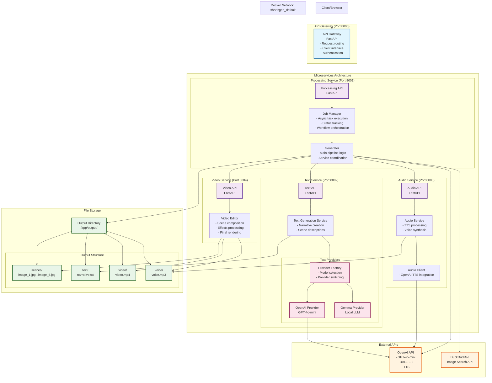
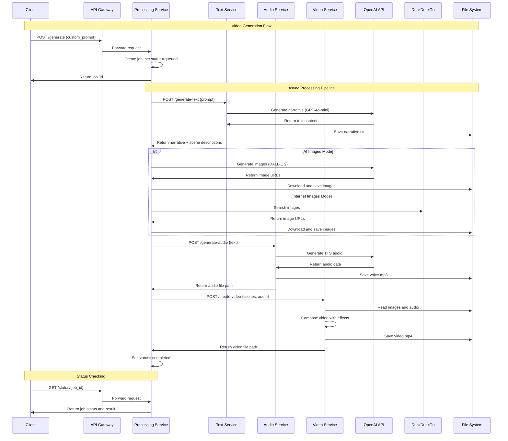
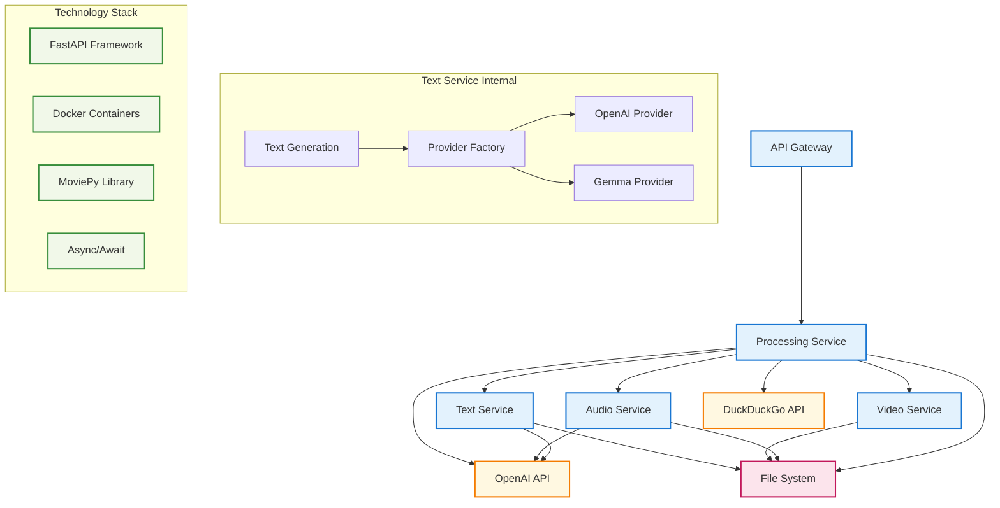
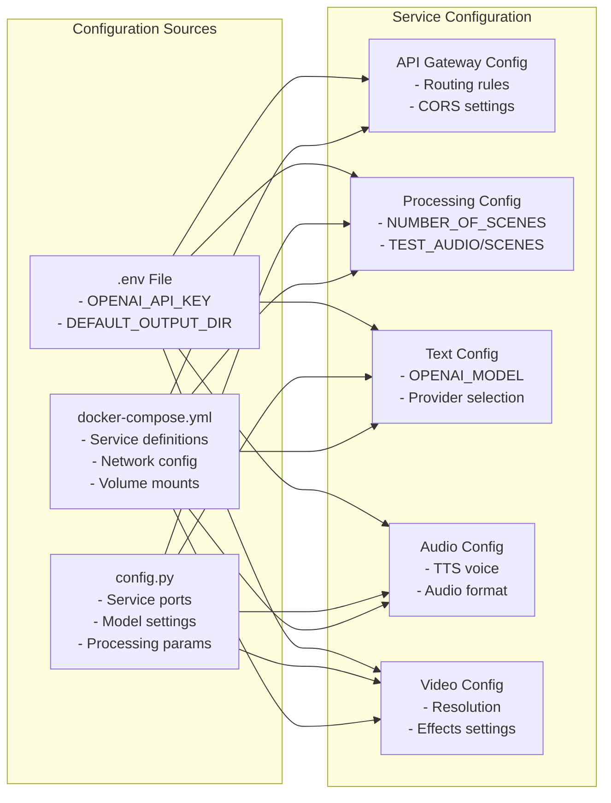

# ShortsGen Architecture

## Component Diagram

## Data Flow Diagram

## Service Dependencies

## Configuration Architecture

## Key Components Description

### API Gateway (Port 8000)
- **Purpose**: Single entry point for all client requests
- **Technology**: FastAPI
- **Responsibilities**: 
  - Request routing to appropriate services
  - Client interface management
  - Basic authentication and validation

### Processing Service (Port 8001)
- **Purpose**: Central orchestrator for video generation workflow
- **Technology**: FastAPI with async task management
- **Key Components**:
  - **Job Manager**: Handles async job execution and status tracking
  - **Generator**: Main pipeline logic, coordinates all other services
  - **Service Clients**: Interfaces to text, audio, and video services

### Text Service (Port 8002)
- **Purpose**: AI-powered text and narrative generation
- **Technology**: FastAPI with pluggable AI providers
- **Key Features**:
  - Multiple AI provider support (OpenAI GPT-4o-mini, Gemma)
  - Factory pattern for provider selection
  - Scene description generation

### Audio Service (Port 8003)
- **Purpose**: Text-to-speech audio generation
- **Technology**: FastAPI with OpenAI TTS integration
- **Features**:
  - High-quality voice synthesis
  - Multiple voice options
  - Audio format optimization

### Video Service (Port 8004)
- **Purpose**: Final video composition and rendering
- **Technology**: FastAPI with MoviePy
- **Capabilities**:
  - Multi-scene video composition
  - Audio synchronization
  - Visual effects and transitions
  - Export optimization

## Deployment Architecture

The system uses Docker Compose for orchestration with:
- **Network**: Custom Docker network `shortsgen_default`
- **Volumes**: Shared output directory across services
- **Health Checks**: Built-in service health monitoring
- **Scaling**: Individual service scaling capability
- **Development**: Hot reload support for development mode
