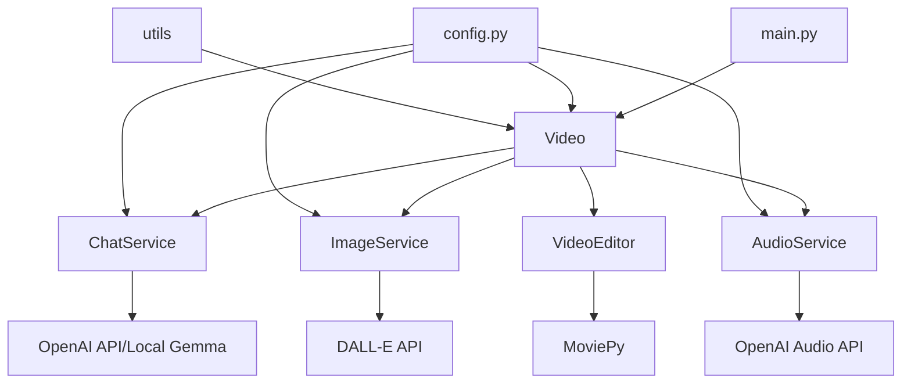
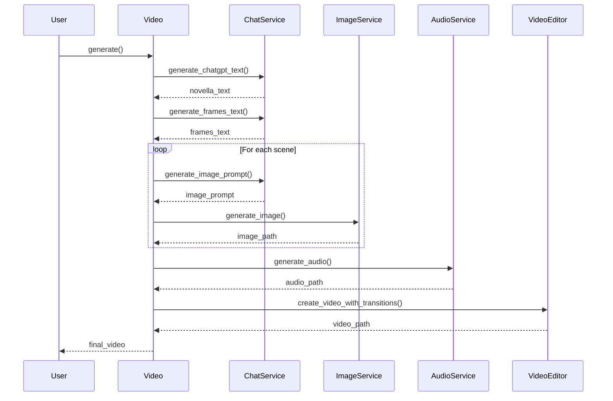
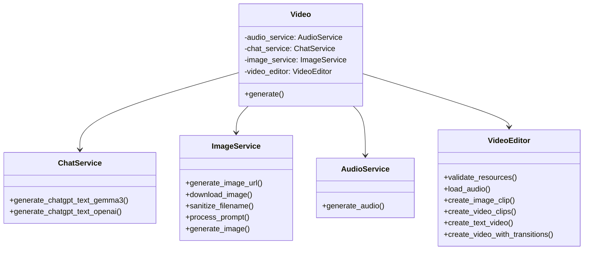

# Creative Video Generator

This is a project for generating creative videos using OpenAI API, MoviePy and other libraries. The project is divided into modules to easily maintain and extend functionality.

## Project Structure

- **config.py**: Configuration and API keys.
- **main.py**: Main launch script.
- **api.py**: API server for continuous operation.
- **services/**: Modules with business logic for generating text, images, audio, and video.
- **utils/**: Helper functions.

## Installing Dependencies

```bash
pip install -r requirements.txt
```

## Docker Support

### Prerequisites
- Docker installed on your system
- API keys for OpenAI and DeepAI services

### Building the Docker Image
```bash
docker build -t shortsgen .
```

### Running the Container as an API Service
Create a `.env` file with your API keys:
```
OPENAI_API_KEY=your_openai_key
DEFAULT_OUTPUT_DIR=/app/output
```

Run the container with API exposed:

For PowerShell in Windows Terminal:
```powershell
docker run -d -p 8000:8000 `
    --env-file .env `
    -v .\output:/app/output `
    --name shortsgen `
    shortsgen
```

This command:
- Starts the container in detached mode (-d)
- Maps port 8000 from the container to your local machine
- Uses your environment variables from `.env`
- Mounts the local `output` directory to the container's output directory

### API Usage

The API provides the following endpoints:

- `GET /` - Health check endpoint
- `POST /generate` - Start a video generation job
- `GET /status/{job_id}` - Check the status of a generation job

#### Example: Start a generation job

```bash
curl -X POST "http://localhost:8000/generate" \
    -H "Content-Type: application/json" \
    -d '{}'
```

For PowerShell in Windows:

```powershell
Invoke-RestMethod -Method POST -Uri "http://localhost:8000/generate" -ContentType "application/json" -Body '{}'
```

Or alternative PowerShell syntax:

```powershell
$body = @{} | ConvertTo-Json
Invoke-RestMethod -Method POST -Uri "http://localhost:8000/generate" -ContentType "application/json" -Body $body
```

#### Example: Check job status

```bash
curl -X GET "http://localhost:8000/status/0"
```

## Original Functionality

If you prefer to use the original functionality without the API:

```powershell
docker run --rm `
    --env-file .env `
    -v .\output:/app/output `
    shortsgen python main.py
```

## Project Architecture

### Component Diagram



### Video Generation Process



### Class Structure



### Data Flow

```
+----------------+     +----------------+     +----------------+
| Text           |     | Images         |     | Audio          |
| script         | --> | for scenes     | --> | narrative      | 
| (novella_text) |     | (scene images) |     | (audio file)   |
+----------------+     +----------------+     +----------------+
                                                      |
                                                      v
                                            +----------------+
                                            | Final          |
                                            | video          |
                                            | (final video)  |
                                            +----------------+
```

### Dependencies Table

| Library | Version | Purpose |
|------------|--------|------------|
| request | 2.31.0 | HTTP requests to API |
| moviepy | 1.0.3 | Processing and creating videos |
| numpy | 1.25.2 | Working with data arrays |
| openai | 0.28.0 | Interaction with OpenAI API |
| python-dotenv | 1.0.0 | Loading environment variables |

### Directory Tree

```
c:\git\shortsgen\
│
├── main.py                # Main entry point
├── config.py              # Project configuration
├── requirements.txt       # Project dependencies
├── README.md              # Documentation
│
├── services\              # Service modules
│   ├── __init__.py
│   ├── audio_service.py   # Audio generation
│   ├── chat_service.py    # Text generation
│   ├── image_service.py   # Image generation
│   ├── video.py           # Main video process
│   └── video_service.py   # Video editing
│
└── utils\                 # Utility tools
    ├── __init__.py
    ├── file_utils.py      # File operations
    └── logger.py          # Logging
```

### Configuration Parameters Table

| Parameter | Type | Description |
|----------|-----|----------|
| DEEPAI_API_KEY | string | API key for DeepAI |
| OPENAI_API_KEY | string | API key for OpenAI |
| DEFAULT_IMAGE_SIZE | string | Default image size |
| DEFAULT_OUTPUT_DIR | string | Path to output directory |
| DALLE_MODEL | string | DALL-E model for image generation |
| OPENAI_MODEL | string | OpenAI model for audio generation |
| LOCAL_TEXT_TO_TEXT_MODEL | string | Local model for text generation |
| LOCAL | boolean | Flag for using local models |
| NUMBER_OF_THE_SCENES | int | Number of scenes to generate |
