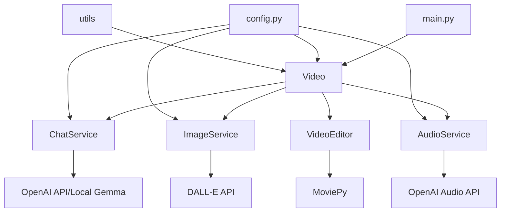
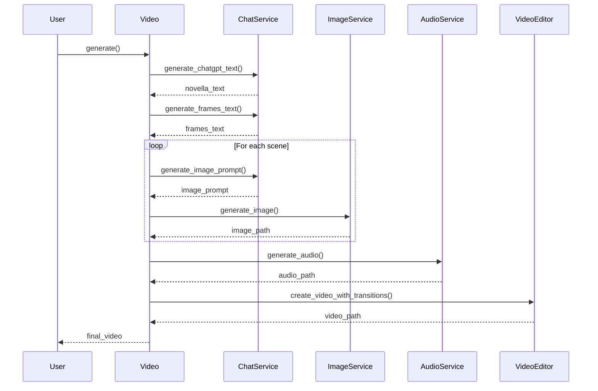
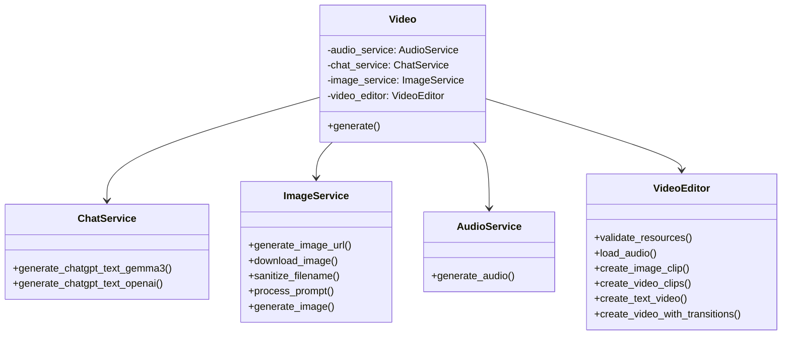

# Creative Video Generator

Это проект для генерации креативного видео с использованием OpenAI API, MoviePy и других библиотек. Проект разделён на модули, чтобы легко поддерживать и расширять функциональность.

## Структура проекта

- **config.py**: Конфигурация и API-ключи.
- **main.py**: Основной скрипт запуска.
- **services/**: Модули с бизнес-логикой для генерации текста, изображений, аудио и видео.
- **utils/**: Вспомогательные функции.

## Установка зависимостей

```bash
pip install -r requirements.txt
```

## Архитектура проекта

### Диаграмма компонентов



### Процесс генерации видео



### Структура классов



### Поток данных

```
+----------------+     +----------------+     +----------------+
| Текстовый      |     | Изображения    |     | Аудио          |
| сценарий       | --> | для сцен       | --> | нарратив       | 
| (novella_text) |     | (scene images) |     | (audio file)   |
+----------------+     +----------------+     +----------------+
                                                      |
                                                      v
                                            +----------------+
                                            | Финальное      |
                                            | видео          |
                                            | (final video)  |
                                            +----------------+
```

### Таблица зависимостей

| Библиотека | Версия | Назначение |
|------------|--------|------------|
| request | 2.31.0 | HTTP-запросы к API |
| moviepy | 1.0.3 | Обработка и создание видео |
| numpy | 1.25.2 | Работа с массивами данных |
| openai | 0.28.0 | Взаимодействие с OpenAI API |
| python-dotenv | 1.0.0 | Загрузка переменных окружения |

### Дерево директорий

```
c:\git\shortsgen\
│
├── main.py                # Основная точка входа
├── config.py              # Конфигурация проекта
├── requirements.txt       # Зависимости проекта
├── README.md              # Документация
│
├── services\              # Модули сервисов
│   ├── __init__.py
│   ├── audio_service.py   # Генерация аудио
│   ├── chat_service.py    # Генерация текста
│   ├── image_service.py   # Генерация изображений
│   ├── video.py           # Основной видео-процесс
│   └── video_service.py   # Редактирование видео
│
└── utils\                 # Вспомогательные утилиты
    ├── __init__.py
    ├── file_utils.py      # Работа с файлами
    └── logger.py          # Логирование
```

### Таблица конфигурационных параметров

| Параметр | Тип | Описание |
|----------|-----|----------|
| DEEPAI_API_KEY | string | API ключ для DeepAI |
| OPENAI_API_KEY | string | API ключ для OpenAI |
| DEFAULT_IMAGE_SIZE | string | Размер изображения по умолчанию |
| DEFAULT_OUTPUT_DIR | string | Путь к директории вывода |
| DALLE_MODEL | string | Модель DALL-E для генерации изображений |
| OPENAI_MODEL | string | Модель OpenAI для генерации аудио |
| LOCAL_TEXT_TO_TEXT_MODEL | string | Локальная модель для генерации текста |
| LOCAL | boolean | Флаг использования локальных моделей |
| NUMBER_OF_THE_SCENES | int | Количество сцен для генерации |
