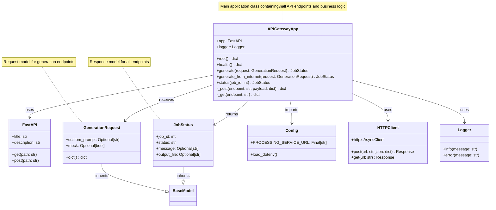

# Диаграмма классов для API Gateway

## UML Class Diagram

## Описание компонентов

### Основные классы:

1. **APIGatewayApp** - Главный класс приложения
   - Содержит все эндпоинты API
   - Управляет маршрутизацией запросов к processing service
   - Обрабатывает логику mock режима

2. **GenerationRequest** - Модель запроса
   - Наследуется от Pydantic BaseModel
   - Содержит параметры для генерации контента

3. **JobStatus** - Модель ответа
   - Наследуется от Pydantic BaseModel
   - Представляет статус задачи генерации

4. **Config** - Модуль конфигурации
   - Содержит настройки приложения
   - Управляет переменными окружения

### API Endpoints:

| Endpoint | Method | Description |
|----------|--------|-------------|
| `/` | GET | Корневой эндпоинт, возвращает статус сервиса |
| `/health` | GET | Проверка здоровья сервиса |
| `/generate` | POST | Генерация контента |
| `/generateFromInternet` | POST | Генерация контента из интернета |
| `/status/{job_id}` | GET | Получение статуса задачи |

### Внешние зависимости:

- **FastAPI** - Web framework
- **Pydantic** - Data validation
- **httpx** - HTTP client для асинхронных запросов
- **uvicorn** - ASGI server

### Паттерны проектирования:

1. **Gateway Pattern** - API Gateway маршрутизирует запросы к внутренним сервисам
2. **Proxy Pattern** - Сервис действует как прокси для processing service
3. **Model-View-Controller** - Разделение моделей данных и логики обработки

## Архитектурные особенности:

- **Асинхронная обработка** - Все операции выполняются асинхронно
- **Централизованная маршрутизация** - Единая точка входа для всех запросов
- **Mock режим** - Возможность тестирования без обращения к внешним сервисам
- **Логирование** - Централизованное логирование всех операций
- **Обработка ошибок** - Проксирование ошибок от внутренних сервисов
