```mermaid
classDiagram
    %% ====================
    %% API Layer
    %% ====================
    class FastAPI {
        <<framework>>
        +app: FastAPI
        +middleware: List[Middleware]
        +routes: List[APIRoute]
    }

    class JobManager {
        +jobs: Dict[int, JobData]
        +current_job_id: int
        +create_job() int
        +get_job(job_id: int) JobData
        +update_job(job_id: int, **kwargs) None
        +list_jobs() List[JobData]
        +delete_job(job_id: int) bool
    }

    class JobData {
        +status: str
        +message: str
        +output_file: Optional[str]
        +created_at: datetime
        +completed_at: Optional[datetime]
        +error_details: Optional[str]
    }

    class GenerationRequest {
        <<request_model>>
        +custom_prompt: Optional[str]
        +mock: Optional[bool]
        +strategy: Optional[GenerationStrategy]
    }

    class JobStatus {
        <<response_model>>
        +job_id: int
        +status: str
        +message: Optional[str]
        +output_file: Optional[str]
        +progress: Optional[float]
    }

    %% ====================
    %% Core Orchestration
    %% ====================
    class WorkflowOrchestrator {
        -content_generator: ContentGenerator
        -media_processor: MediaProcessor
        -retry_config: RetryConfig
        +execute_workflow(strategy: GenerationStrategy, custom_prompt: str) WorkflowResult
        +get_workflow_status(workflow_id: str) Dict[str, Any]
        -_create_failure_result(error: str, state: WorkflowState, start_time: float) WorkflowResult
        -_handle_workflow_stage(stage_func: callable, state: WorkflowState) StageResult
    }

    %% ====================
    %% Content Generation
    %% ====================
    class ContentGenerator {
        -text_service: TextService
        -retry_config: RetryConfig
        +generate_narrative(custom_prompt: Optional[str]) StageResult
        +generate_scene_descriptions(narrative_text: str) StageResult
        +generate_search_queries(narrative_text: str) StageResult
        -_validate_narrative(text: str) bool
        -_parse_scene_descriptions(response: str) List[str]
    }

    class TextService {
        -text_client: TextClient
        -provider_factory: ProviderFactory
        +generate_text(prompt: str, **kwargs) Union[str, Dict]
        +get_available_models() List[str]
        -_format_prompt(prompt: str) str
        -_validate_response(response: Any) bool
    }

    %% ====================
    %% Media Processing
    %% ====================
    class MediaProcessor {
        -audio_client: AudioClient
        -video_client: VideoClient
        -image_service: ImageService
        -retry_config: RetryConfig
        +generate_scene_images(scene_descriptions: List[str]) StageResult
        +find_web_images(search_queries: List[str]) StageResult
        +generate_audio(narrative_text: str) StageResult
        +create_video(images: List[str], audio_path: str) StageResult
        -_validate_media_files(files: List[str]) bool
        -_cleanup_temp_files(files: List[str]) None
    }

    class ImageService {
        -openai_client: OpenAI
        -ddg_search: DDGS
        +generate_image(prompt: str, size: str, filename: str) Optional[str]
        +search_images(query: str, max_results: int) List[ImageResult]
        +download_image(url: str, filename: str) Optional[str]
        -_validate_image_url(url: str) bool
        -_resize_image(path: str, target_size: Tuple[int, int]) str
    }

    %% ====================
    %% External Service Clients
    %% ====================
    class AudioClient {
        +base_url: str
        +timeout: int
        +session: requests.Session
        +generate_audio_stream(text: str, voice: str, **kwargs) bool
        +check_service_health() bool
        -_prepare_audio_request(text: str, voice: str) Dict
        -_handle_response(response: requests.Response) bool
    }

    class TextClient {
        +base_url: str
        +timeout: int
        +session: requests.Session
        +generate_text(prompt: str, **kwargs) Union[str, Dict]
        +check_service_health() bool
        -_prepare_text_request(prompt: str) Dict
        -_handle_response(response: requests.Response) Union[str, Dict]
    }

    class VideoClient {
        +base_url: str
        +timeout: int
        +session: requests.Session
        +generate_video(images: List[str], audio: str, **kwargs) Dict
        +check_service_health() bool
        -_prepare_video_request(images: List[str], audio: str) Dict
        -_handle_response(response: requests.Response) Dict
    }

    %% ====================
    %% State Management
    %% ====================
    class WorkflowState {
        +workflow_id: str
        +started_at: datetime
        +completed_at: Optional[datetime]
        +results: Dict[str, StageResult]
        +metadata: Dict[str, Any]
        +add_result(stage_name: str, result: StageResult) None
        +get_completed_stages() List[str]
        +get_failed_stages() List[str]
        +is_completed() bool
        +to_dict() Dict[str, Any]
        +get_progress() float
    }

    class StageResult {
        +stage_name: str
        +status: StageStatus
        +data: Any
        +error_message: Optional[str]
        +started_at: Optional[datetime]
        +completed_at: Optional[datetime]
        +duration_seconds: Optional[float]
        +get_execution_time() Optional[float]
        +is_successful() bool
    }
    
    class WorkflowResult {
        +success: bool
        +output_path: Optional[str]
        +error_message: Optional[str]
        +state: Optional[WorkflowState]
        +elapsed_time: Optional[float]
        +get_summary() Dict[str, Any]
        +is_successful() bool
    }

    %% ====================
    %% Enums and Data Models
    %% ====================
    class StageStatus {
        <<enumeration>>
        PENDING
        RUNNING
        COMPLETED
        FAILED
        SKIPPED
    }

    class GenerationStrategy {
        <<enumeration>>
        AI_GENERATED
        WEB_SEARCH
    }

    class GenerationStage {
        <<enumeration>>
        NOVELLA_TEXT
        SCENE_DESCRIPTIONS
        IMAGE_SEARCH_QUERIES
        SCENE_IMAGES
        VOICE_NARRATION
        VIDEO_COMPOSITION
    }

    class ImageSize {
        <<enumeration>>
        SMALL
        MEDIUM
        LARGE
        CUSTOM
    }

    class ImageResult {
        +url: str
        +title: Optional[str]
        +thumbnail: Optional[str]
        +source: str
        +width: Optional[int]
        +height: Optional[int]
        +file_size: Optional[int]
        +download_url: Optional[str]
    }

    class OperationResult~T~ {
        <<generic>>
        +success: bool
        +data: Optional[T]
        +error_message: Optional[str]
        +elapsed_time: Optional[float]
        +stage: Optional[GenerationStage]
        +__bool__() bool
        +get_data_or_raise() T
    }

    %% ====================
    %% Legacy Components
    %% ====================
    class Generator {
        <<legacy>>
        -orchestrator: WorkflowOrchestrator
        +find_and_generate(custom_prompt: str) OperationResult
        +generate_with_ai(custom_prompt: str) OperationResult
        +mock_generation(custom_prompt: str) OperationResult
    }

    class RetryConfig {
        +max_attempts: int
        +base_delay: float
        +max_delay: float
        +exponential_base: float
        +jitter: bool
    }

    %% ====================
    %% Provider System
    %% ====================
    class ProviderFactory {
        +create_provider(provider_type: str) BaseProvider
        +get_available_providers() List[str]
    }

    class BaseProvider {
        <<abstract>>
        +generate_text(prompt: str, **kwargs) str
        +get_model_info() Dict[str, Any]
        +is_available() bool
    }

    class OpenAIProvider {
        -client: OpenAI
        -model: str
        +generate_text(prompt: str, **kwargs) str
        +get_model_info() Dict[str, Any]
        +is_available() bool
    }

    class GemmaProvider {
        -model_path: str
        -config: Dict[str, Any]
        +generate_text(prompt: str, **kwargs) str
        +get_model_info() Dict[str, Any]
        +is_available() bool
    }

    %% ====================
    %% Relationships
    %% ====================
    
    %% API Layer
    FastAPI -- "uses" JobManager
    FastAPI -- "handles" GenerationRequest
    FastAPI -- "returns" JobStatus
    JobManager *-- "manages" JobData

    %% Core Orchestration
    WorkflowOrchestrator o-- ContentGenerator
    WorkflowOrchestrator o-- MediaProcessor
    WorkflowOrchestrator --> WorkflowState
    WorkflowOrchestrator --> WorkflowResult
    WorkflowOrchestrator ..> GenerationStrategy
    WorkflowOrchestrator ..> RetryConfig

    %% Content Generation
    ContentGenerator o-- TextService
    ContentGenerator --> StageResult
    ContentGenerator ..> RetryConfig

    %% Text Generation System
    TextService o-- TextClient
    TextService o-- ProviderFactory
    ProviderFactory --> BaseProvider
    BaseProvider <|-- OpenAIProvider
    BaseProvider <|-- GemmaProvider

    %% Media Processing
    MediaProcessor o-- ImageService
    MediaProcessor o-- AudioClient
    MediaProcessor o-- VideoClient
    MediaProcessor --> StageResult
    MediaProcessor ..> RetryConfig

    %% Image Service
    ImageService --> ImageResult
    ImageService ..> ImageSize

    %% State Management
    WorkflowState *-- "many" StageResult
    WorkflowResult o-- WorkflowState
    StageResult ..> StageStatus
    WorkflowState ..> GenerationStage

    %% Legacy System
    Generator o-- WorkflowOrchestrator
    Generator --> OperationResult

    %% Data Flow
    StageResult ..> GenerationStage
    OperationResult ..> GenerationStage
```

## 📝 Описание архитектуры

### 🏗️ Основные компоненты системы

#### **API Layer (Слой API)**
- **FastAPI** - Web-фреймворк для обработки HTTP запросов
- **JobManager** - Управление задачами генерации видео
- **JobData** - Модель данных для отслеживания состояния задач
- **GenerationRequest/JobStatus** - Модели запросов и ответов API

#### **Core Orchestration (Основная оркестрация)**
- **WorkflowOrchestrator** - Главный координатор процесса генерации
- Управляет последовательностью этапов генерации
- Обрабатывает ошибки и повторные попытки
- Координирует работу ContentGenerator и MediaProcessor

#### **Content Generation (Генерация контента)**
- **ContentGenerator** - Генерация текстового контента
- **TextService** - Сервис для работы с текстовыми AI моделями
- **ProviderFactory** - Фабрика для создания провайдеров AI
- Поддержка различных AI провайдеров (OpenAI, Gemma)

#### **Media Processing (Обработка медиа)**
- **MediaProcessor** - Обработка мультимедийного контента
- **ImageService** - Генерация и поиск изображений
- **AudioClient/VideoClient** - Клиенты для работы с аудио/видео сервисами

#### **State Management (Управление состоянием)**
- **WorkflowState** - Отслеживание состояния workflow
- **StageResult** - Результат выполнения отдельного этапа
- **WorkflowResult** - Итоговый результат всего процесса

### 🔄 Процесс генерации видео

1. **Получение запроса** - API получает запрос через GenerationRequest
2. **Создание задачи** - JobManager создает новую задачу
3. **Инициализация Workflow** - WorkflowOrchestrator запускает процесс
4. **Генерация контента**:
   - Создание нарратива (narrative)
   - Генерация описаний сцен
   - Создание поисковых запросов
5. **Обработка медиа**:
   - Генерация/поиск изображений
   - Создание аудиодорожки
   - Сборка финального видео
6. **Возврат результата** - Обновление статуса задачи и возврат результата

### 🎯 Ключевые принципы архитектуры

#### **Separation of Concerns (Разделение ответственности)**
- Каждый компонент имеет четко определенную роль
- ContentGenerator отвечает только за текстовый контент
- MediaProcessor обрабатывает только медиа-файлы
- WorkflowOrchestrator координирует весь процесс

#### **Resilience (Устойчивость)**
- **RetryConfig** - Настройка повторных попыток
- Обработка ошибок на каждом уровне
- Детальное логирование и отслеживание состояния

#### **Extensibility (Расширяемость)**
- **ProviderFactory** позволяет легко добавлять новые AI провайдеры
- Модульная архитектура упрощает добавление новых функций
- Enum-ы для типизации стратегий и статусов

#### **Monitoring & Observability (Мониторинг)**
- Детальное отслеживание времени выполнения
- Структурированные логи и метрики
- Возможность отслеживания прогресса выполнения

### 📊 Типы данных и состояния

#### **Статусы выполнения (StageStatus)**
- `PENDING` - Этап ожидает выполнения
- `RUNNING` - Этап выполняется
- `COMPLETED` - Этап успешно завершен
- `FAILED` - Этап завершился с ошибкой
- `SKIPPED` - Этап пропущен

#### **Стратегии генерации (GenerationStrategy)**
- `AI_GENERATED` - Использование AI для генерации изображений
- `WEB_SEARCH` - Поиск изображений в интернете

#### **Этапы генерации (GenerationStage)**
- `NOVELLA_TEXT` - Генерация основного текста
- `SCENE_DESCRIPTIONS` - Создание описаний сцен
- `IMAGE_SEARCH_QUERIES` - Формирование поисковых запросов
- `SCENE_IMAGES` - Получение изображений для сцен
- `VOICE_NARRATION` - Создание аудиодорожки
- `VIDEO_COMPOSITION` - Сборка финального видео

### 🔧 Паттерны проектирования

#### **Factory Pattern**
- `ProviderFactory` для создания различных AI провайдеров
- Упрощает добавление новых провайдеров без изменения основного кода

#### **Strategy Pattern**
- `GenerationStrategy` для выбора стратегии генерации
- Позволяет динамически менять алгоритм генерации

#### **State Pattern**
- `WorkflowState` для отслеживания состояния процесса
- Обеспечивает контролируемое изменение состояний

#### **Decorator Pattern**
- Retry декораторы для обработки ошибок
- Логирование и метрики как аспекты

### 🚀 Производительность и масштабируемость

#### **Асинхронность**
- FastAPI обеспечивает асинхронную обработку запросов
- Возможность параллельной обработки нескольких задач

#### **Кеширование**
- Возможность кеширования результатов AI генерации
- Оптимизация повторных запросов

#### **Мониторинг ресурсов**
- Отслеживание времени выполнения каждого этапа
- Метрики использования внешних сервисов

### 🔒 Безопасность и надежность

#### **Валидация данных**
- Проверка входных параметров через Pydantic модели
- Валидация результатов на каждом этапе

#### **Обработка ошибок**
- Graceful degradation при недоступности сервисов
- Детальная информация об ошибках для отладки

#### **Изоляция компонентов**
- Каждый сервис изолирован и может быть заменен
- Минимизация влияния сбоев одного компонента на другие

### 🔄 Legacy Support

#### **Backward Compatibility**
- `Generator` класс обеспечивает совместимость со старым API
- Постепенная миграция на новую архитектуру

#### **Migration Path**
- Четкий путь миграции от legacy к новой системе
- Возможность работы обеих систем параллельно

---

*Диаграмма отражает текущее состояние архитектуры Processing Service и может быть обновлена по мере развития системы.*
