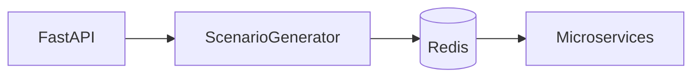
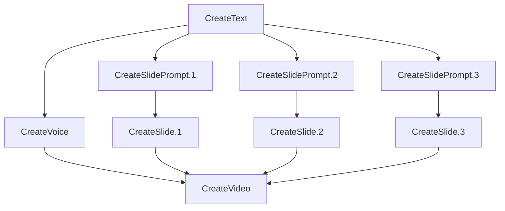

# Processing Service

processing-service микросервис, который берёт входной сценарий, детерминированно разворачивает его в линейный список сообщений и отправляет в Redis. Пример ScenarioCreateVideo

queue:text-service   ← CreateText(description)
queue:voice-service  ← CreateVoice
queue:text-service   ← CreateSlidePrompt(№1)
queue:text-service   ← CreateSlidePrompt(№2)
...
queue:image-service  ← CreateSlide(№1)
queue:image-service  ← CreateSlide(№2)
...
queue:video-service  ← CreateVideoFromSlides
Порядок в строках отражает зависимостные барьеры: сначала текст → слайды → финальный рендер.

## Архитектура



### Компоненты
- **FastAPI** - REST API для создания и мониторинга сценариев
- **ScenarioGenerator** - Разворачивает шаблон в задачи с зависимостями
- **Redis** - Очереди задач для микросервисов

### Flow
1. POST /generate → создает сценарий и задачи
2. ScenarioGenerator размещает задачи в Redis очереди
3. Микросервисы забирают и выполняют задачи
4. GET /scenarios/{id} → мониторинг прогресса

## Формат задач в scenaries.yml

Пример задачи CreateText из `scenaries.yml`:

```yaml
- id:      "{{ SHORT_UUID('CreateText') }}"
  scenario_id: "{{ SHORT_UUID('ScenarioCreateVideo') }}"
  service: text-service
  name:    CreateText
  queue:   0                    # количество зависимостей для выполнения
  status:  pending
  created_at: "{{ now() }}"
  updated_at: "{{ now() }}"
  consumers:                    # список задач, которые зависят от этой
    - "{{ SHORT_UUID('CreateVoice') }}"
    - "{{ SHORT_UUID('CreateSlidePrompt.1') }}"
    - "{{ SHORT_UUID('CreateSlidePrompt.2') }}"
    - "{{ SHORT_UUID('CreateSlidePrompt.3') }}"
  prompt: "{{ PROMPT }}"
  params:
    model: gpt-4o-mini
```

## Шаблонизация с Jinja2

Сценарий использует Jinja2 шаблоны для:
- **SHORT_UUID()** - генерация коротких UUID для задач
- **now()** - текущая дата/время
- **Переменные** - подстановка из блока `variables`
- **Циклы** - генерация повторяющихся задач


## Пример шаблона сценария

Реальный шаблон сценария ScenarioCreateVideo из `scenaries.yml`:

```yaml
scenario_id: "{{ SHORT_UUID('ScenarioCreateVideo') }}"
version: "1.0.0"
name: ScenarioCreateVideo

variables:
  N_SLIDES: 3
  PROMPT: "Напиши короткий текст про кота"
  VIDEO_RESOLUTION: "1920x1080"

tasks:
  # 1. Генерируем основной текст
  - id: "{{ SHORT_UUID('CreateText') }}"
    scenario_id: "{{ SHORT_UUID('ScenarioCreateVideo') }}"
    service: text-service
    name: CreateText
    queue: 0
    status: pending
    created_at: "{{ now() }}"
    updated_at: "{{ now() }}"
    consumers:
      - "{{ SHORT_UUID('CreateVoice') }}"

      - "{{ SHORT_UUID('CreateSlidePrompt.' ~ i) }}"

    prompt: "{{ PROMPT }}"
    params:
      model: gpt-4o-mini

  # 2. Озвучиваем этот текст
  - id: "{{ SHORT_UUID('CreateVoice') }}"
    scenario_id: "{{ SHORT_UUID('ScenarioCreateVideo') }}"
    service: voice-service
    name: CreateVoice
    queue: 0
    status: pending
    created_at: "{{ now() }}"
    updated_at: "{{ now() }}"
    consumers:
      - "{{ SHORT_UUID('CreateVideo') }}"
    text_task_id: "{{ SHORT_UUID('CreateText') }}"

  # 3. Для каждого слайда: генерируем промпт и создаём картинку

  - id: "{{ SHORT_UUID('CreateSlidePrompt.' ~ i) }}"
    scenario_id: "{{ SHORT_UUID('ScenarioCreateVideo') }}"
    service: text-service
    name: CreateSlidePrompt
    queue: 0
    status: pending
    created_at: "{{ now() }}"
    updated_at: "{{ now() }}"
    consumers:
      - "{{ SHORT_UUID('CreateSlide.' ~ i) }}"
    prompt: "Сформулируй заголовок для слайда {{ i }}"
    params:
      model: gpt-4o-mini

  - id: "{{ SHORT_UUID('CreateSlide.' ~ i) }}"
    scenario_id: "{{ SHORT_UUID('ScenarioCreateVideo') }}"
    service: image-service
    name: CreateSlide
    queue: 0
    status: pending
    created_at: "{{ now() }}"
    updated_at: "{{ now() }}"
    consumers:
      - "{{ SHORT_UUID('CreateVideo') }}"
    slide_prompt_id: "{{ SHORT_UUID('CreateSlidePrompt.' ~ i) }}"
    params:
      style: modern-flat
      resolution: "{{ VIDEO_RESOLUTION }}"


  # Финальный таск: собираем видео
  - id: "{{ SHORT_UUID('CreateVideo') }}"
    scenario_id: "{{ SHORT_UUID('ScenarioCreateVideo') }}"
    service: video-service
    name: CreateVideoFromSlides
    queue: {{ N_SLIDES }}          # ждёт N_SLIDES слайдов и голосовую дорожку
    status: pending
    created_at: "{{ now() }}"
    updated_at: "{{ now() }}"
    consumers: []
    slide_ids:

      - "{{ SHORT_UUID('CreateSlide.' ~ i) }}"

    voice_track_id: "{{ SHORT_UUID('CreateVoice') }}"
```

### Ключевые особенности

1. **Consumers вместо dependencies** - задача указывает список потребителей (кто от неё зависит)
2. **Queue как счётчик** - количество зависимостей, которые должны завершиться
3. **Jinja2 циклы** - для генерации повторяющихся слайдов
4. **SHORT_UUID** - генерация уникальных, но коротких идентификаторов
5. **Прямые ссылки** - `text_task_id`, `slide_prompt_id` для связи между задачами


## Модель данных

Структура данных в `scenaries.yml`:

| Поле | Назначение | Тип | Пример |
|------|------------|-----|--------|
| scenario_id | Уникальный ID сценария | UUID | `{{ SHORT_UUID('ScenarioCreateVideo') }}` |
| version | Версия шаблона | string | `"1.0.0"` |
| name | Название сценария | string | `ScenarioCreateVideo` |
| variables | Переменные шаблона | dict | `N_SLIDES: 3, PROMPT: "..."` |
| tasks | Список задач | list | см. ниже |

### Структура задачи

| Поле | Назначение | Тип | Пример |
|------|------------|-----|--------|
| id | Уникальный ID задачи | UUID | `{{ SHORT_UUID('CreateText') }}` |
| scenario_id | Ссылка на сценарий | UUID | из переменной |
| service | Целевой микросервис | string | `text-service`, `voice-service` |
| name | Название операции | string | `CreateText`, `CreateVoice` |
| queue | Количество зависимостей | int | `0` (готова), `3` (ждёт 3 задачи) |
| status | Статус выполнения | enum | `pending`, `processing`, `success`, `failed` |
| consumers | Список зависимых задач | list[UUID] | задачи, которые ждут эту |
| params | Параметры для сервиса | dict | специфичны для каждого сервиса |
| *_task_id | Ссылки на результаты | UUID | `text_task_id`, `slide_prompt_id` |

### Пример набора записей подготовленного к отправке

```cjson
   {'id': '579a000e', 'scenario_id': '57510f0b', 'service': 'text-service', 'name': 'CreateText', 'queue': 0, 'status': 'pending', 'created_at': '2025-06-26T22:36:42.354115', 'updated_at': '2025-06-26T22:36:42.354138', 'consumers': ['b9c70fa3', '4bba60ea', 'bfe18b59', '9e4b227f'], 'prompt': 'Напиши короткий текст про кота', 'params': {'model': 'gpt-4o-mini'}}
   {'id': 'b9c70fa3', 'scenario_id': '57510f0b', 'service': 'voice-service', 'name': 'CreateVoice', 'queue': 0, 'status': 'pending', 'created_at': '2025-06-26T22:36:42.354160', 'updated_at': '2025-06-26T22:36:42.354162', 'consumers': ['4841187f'], 'text_task_id': '579a000e'}
   {'id': '4bba60ea', 'scenario_id': '57510f0b', 'service': 'text-service', 'name': 'CreateSlidePrompt', 'queue': 0, 'status': 'pending', 'created_at': '2025-06-26T22:36:42.354170', 'updated_at': '2025-06-26T22:36:42.354171', 'consumers': ['9db3d6da'], 'prompt': 'Сформулируй заголовок для слайда 1', 'params': {'model': 'gpt-4o-mini'}}
   {'id': '9db3d6da', 'scenario_id': '57510f0b', 'service': 'image-service', 'name': 'CreateSlide', 'queue': 0, 'status': 'pending', 'created_at': '2025-06-26T22:36:42.354178', 'updated_at': '2025-06-26T22:36:42.354179', 'consumers': ['4841187f'], 'slide_prompt_id': '4bba60ea', 'params': {'style': 'modern-flat', 'resolution': '1920x1080'}}
   {'id': 'bfe18b59', 'scenario_id': '57510f0b', 'service': 'text-service', 'name': 'CreateSlidePrompt', 'queue': 0, 'status': 'pending', 'created_at': '2025-06-26T22:36:42.354185', 'updated_at': '2025-06-26T22:36:42.354186', 'consumers': ['29d7da22'], 'prompt': 'Сформулируй заголовок для слайда 2', 'params': {'model': 'gpt-4o-mini'}}
   {'id': '29d7da22', 'scenario_id': '57510f0b', 'service': 'image-service', 'name': 'CreateSlide', 'queue': 0, 'status': 'pending', 'created_at': '2025-06-26T22:36:42.354193', 'updated_at': '2025-06-26T22:36:42.354195', 'consumers': ['4841187f'], 'slide_prompt_id': 'bfe18b59', 'params': {'style': 'modern-flat', 'resolution': '1920x1080'}}
   {'id': '9e4b227f', 'scenario_id': '57510f0b', 'service': 'text-service', 'name': 'CreateSlidePrompt', 'queue': 0, 'status': 'pending', 'created_at': '2025-06-26T22:36:42.354201', 'updated_at': '2025-06-26T22:36:42.354202', 'consumers': ['03def52d'], 'prompt': 'Сформулируй заголовок для слайда 3', 'params': {'model': 'gpt-4o-mini'}}
   {'id': '03def52d', 'scenario_id': '57510f0b', 'service': 'image-service', 'name': 'CreateSlide', 'queue': 0, 'status': 'pending', 'created_at': '2025-06-26T22:36:42.354209', 'updated_at': '2025-06-26T22:36:42.354210', 'consumers': ['4841187f'], 'slide_prompt_id': '9e4b227f', 'params': {'style': 'modern-flat', 'resolution': '1920x1080'}}
   {'id': '4841187f', 'scenario_id': '57510f0b', 'service': 'video-service', 'name': 'CreateVideoFromSlides', 'queue': 3, 'status': 'pending', 'created_at': '2025-06-26T22:36:42.354215', 'updated_at': '2025-06-26T22:36:42.354217', 'consumers': [], 'slide_ids': ['9db3d6da', '29d7da22', '03def52d'], 'voice_track_id': 'b9c70fa3'}
```


## Модели данных Python

```python
from dataclasses import dataclass, field
from datetime import datetime
from enum import Enum
from typing import Any, Dict, List, Optional, Union
from uuid import UUID
from pydantic import BaseModel, Field


class TaskStatus(str, Enum):
    PENDING = "pending"
    PROCESSING = "processing" 
    SUCCESS = "success"
    FAILED = "failed"


@dataclass
class Task:
    """Модель задачи из scenaries.yml."""
    id: str
    scenario_id: str
    service: str
    name: str
    queue: int
    status: str
    created_at: datetime
    updated_at: datetime
    consumers: List[str]
    prompt: Optional[str] = None
    text_task_id: Optional[str] = None
    slide_prompt_id: Optional[str] = None
    voice_track_id: Optional[str] = None
    slide_ids: List[str] = field(default_factory=list)
    params: Dict = field(default_factory=dict)


class TaskPydantic(BaseModel):
    """Pydantic модель задачи для валидации."""
    id: str                                   # SHORT_UUID
    scenario_id: str                          # SHORT_UUID
    service: str                              # text-service, voice-service, etc.
    name: str                                 # CreateText, CreateVoice, etc.
    queue: int = 0                            # количество зависимостей
    status: TaskStatus = TaskStatus.PENDING
    created_at: str                           # ISO timestamp
    updated_at: str                           # ISO timestamp  
    consumers: List[str] = []                 # список UUID зависимых задач
    params: Dict[str, Any] = {}               # параметры для сервиса
    result_ref: str = ""                      # результат выполнения
    
    # Дополнительные поля специфичные для типа задачи
    prompt: Optional[str] = None              # для text-service
    text_task_id: Optional[str] = None        # для voice-service
    slide_prompt_id: Optional[str] = None     # для image-service
    slide_ids: Optional[List[str]] = None     # для video-service
    voice_track_id: Optional[str] = None      # для video-service


class Scenario(BaseModel):
    """Сценарий из scenaries.yml."""
    scenario_id: str                          # SHORT_UUID
    version: str
    name: str
    variables: Dict[str, Any] = {}
    tasks: List[TaskPydantic] = []


# Request/Response models
class CreateScenarioRequest(BaseModel):
    scenario: str                             # имя шаблона (ScenarioCreateVideo)
    description: str                          # пользовательский промпт
    slides_count: int = 3                     # количество слайдов


class TaskStatusUpdate(BaseModel):
    status: TaskStatus
    result_ref: Optional[str] = None
```

## CreateVideo Scenario



### Структура зависимостей

1. **CreateText** → порождает весь контент (текст для голоса + промпты для слайдов)
2. **CreateVoice** ← CreateText → преобразует текст в аудио
3. **CreateSlidePrompt.{1,2,3}** ← CreateText → генерирует промпты для каждого слайда
4. **CreateSlide.{1,2,3}** ← CreateSlidePrompt.{i} → создаёт изображения слайдов
5. **CreateVideo** ← CreateVoice + CreateSlide.* → собирает финальное видео

### API

```bash
# Создать сценарий
POST /generate
{
  "scenario": "CreateVideo",
  "description": "Создай видео про котов",
  "slides_count": 3
}

# Мониторинг
GET /scenarios/{scenario_id}
GET /tasks/{task_id}

# Обновление статуса (для воркеров)
PATCH /tasks/{task_id}/status
{
  "status": "success",
  "result_ref": "s3://bucket/result.mp4"
}
```

## Redis Task Format

После обработки шаблона задачи сохраняются в Redis в следующем формате:

```bash
HSET task:short_uuid_CreateText \
  id                "short_uuid_CreateText" \
  scenario_id       "short_uuid_ScenarioCreateVideo" \
  service           "text-service" \
  name              "CreateText" \
  status            "pending" \
  queue             "0"                     # готова к выполнению \
  consumers         "[\"short_uuid_CreateVoice\", \
                      \"short_uuid_CreateSlidePrompt_1\", \
                      \"short_uuid_CreateSlidePrompt_2\", \
                      \"short_uuid_CreateSlidePrompt_3\"]" \
  created_at        "2025-06-26T10:34:12.349Z" \
  updated_at        "2025-06-26T10:34:12.349Z" \
  prompt            "Напиши короткий текст про кота" \
  params            "{\"model\":\"gpt-4o-mini\"}" \
  result_ref        ""                     # будет заполнено воркером
```

## Активация сервиса

### Локальная разработка

1. **Установка зависимостей:**
```bash
cd processing_service
pip install -r requirements.txt
```

2. **Настройка переменных окружения:**
```bash
# .env файл
REDIS_URL=redis://localhost:6379
PORT=8001
DEBUG=true
```

3. **Запуск Redis (если не запущен):**
```bash
# Docker
docker run -d -p 6379:6379 redis:alpine

# Или через docker-compose из корня проекта
docker-compose up redis
```

4. **Запуск сервиса:**
```bash
# Через uvicorn
uvicorn app:app --host 0.0.0.0 --port 8001 --reload

# Или через Python
python app.py
```

### Docker

```bash
# Из корня проекта
docker-compose up processing-service

# Или только сборка сервиса
cd processing_service
docker build -t processing-service .
docker run -p 8001:8001 -e REDIS_URL=redis://redis:6379 processing-service
```

### Проверка работоспособности

```powershell
# Health check
Invoke-RestMethod -Uri "http://localhost:8001/health" -Method Get

# Создание тестового сценария
$body = @{
    scenario = "CreateVideo"
    description = "Создай видео про котов"
    slides_count = 3
} | ConvertTo-Json

Invoke-RestMethod -Uri "http://localhost:8001/generate" `
    -Method Post `
    -ContentType "application/json" `
    -Body $body
```

## Проверка данных в Redis

### Подключение к Redis

```bash
# Через redis-cli
redis-cli -h localhost -p 6379

# Через Docker
docker exec -it <redis_container> redis-cli
```

### Мониторинг задач

#### 1. Просмотр всех ключей задач
```bash
# Поиск всех задач
KEYS task:*

# Поиск задач конкретного сценария
KEYS task:*scenario_id*
```

#### 2. Детальная информация о задаче
```bash
# Получить все поля задачи
HGETALL task:579a000e

# Получить статус задачи
HGET task:579a000e status

# Получить очередь (количество зависимостей)
HGET task:579a000e queue
```

#### 3. Мониторинг очередей задач
```bash
# Просмотр очередей по сервисам
LLEN queue:text-service
LLEN queue:voice-service
LLEN queue:image-service
LLEN queue:video-service

# Просмотр задач в очереди (без удаления)
LRANGE queue:text-service 0 -1

# Просмотр первой задачи в очереди
LINDEX queue:text-service 0
```

#### 4. Мониторинг сценариев
```bash
# Поиск всех сценариев
KEYS scenario:*

# Информация о сценарии
HGETALL scenario:57510f0b

# Список задач сценария
HGET scenario:57510f0b task_ids
```

### Утилиты для отладки

#### Скрипт для мониторинга Redis
```bash
#!/bin/bash
# monitor_redis.sh

echo "=== АКТИВНЫЕ СЦЕНАРИИ ==="
redis-cli KEYS "scenario:*"

echo -e "\n=== ЗАДАЧИ ПО СТАТУСАМ ==="
for status in pending processing success failed; do
    count=$(redis-cli --raw EVAL "
        local tasks = redis.call('KEYS', 'task:*')
        local count = 0
        for i=1,#tasks do
            if redis.call('HGET', tasks[i], 'status') == '$status' then
                count = count + 1
            end
        end
        return count
    " 0)
    echo "$status: $count"
done

echo -e "\n=== ОЧЕРЕДИ ==="
for service in text-service voice-service image-service video-service; do
    len=$(redis-cli LLEN "queue:$service")
    echo "$service: $len задач"
done
```

#### Python скрипт для анализа
```python
import redis
import json
from typing import Dict, List

def analyze_redis_tasks():
    """Анализ состояния задач в Redis."""
    r = redis.Redis(host='localhost', port=6379, decode_responses=True)
    
    # Получаем все задачи
    task_keys = r.keys('task:*')
    
    stats = {
        'total': len(task_keys),
        'by_status': {},
        'by_service': {},
        'ready_to_process': 0
    }
    
    for key in task_keys:
        task = r.hgetall(key)
        status = task.get('status', 'unknown')
        service = task.get('service', 'unknown')
        queue = int(task.get('queue', 0))
        
        # Статистика по статусам
        stats['by_status'][status] = stats['by_status'].get(status, 0) + 1
        
        # Статистика по сервисам
        stats['by_service'][service] = stats['by_service'].get(service, 0) + 1
        
        # Готовые к обработке (queue = 0 и status = pending)
        if queue == 0 and status == 'pending':
            stats['ready_to_process'] += 1
    
    print(json.dumps(stats, indent=2, ensure_ascii=False))

if __name__ == "__main__":
    analyze_redis_tasks()
```

### Очистка Redis для тестирования

```bash
# Удалить все задачи
redis-cli --raw EVAL "
    local keys = redis.call('KEYS', 'task:*')
    for i=1,#keys do
        redis.call('DEL', keys[i])
    end
    return #keys
" 0

# Очистить все очереди
redis-cli DEL queue:text-service queue:voice-service queue:image-service queue:video-service

# Удалить все сценарии
redis-cli --raw EVAL "
    local keys = redis.call('KEYS', 'scenario:*')
    for i=1,#keys do
        redis.call('DEL', keys[i])
    end
    return #keys
" 0

# Полная очистка Redis (ОСТОРОЖНО!)
redis-cli FLUSHALL
```