```mermaid
classDiagram
    %% ====================
    %% API Layer
    %% ====================
    class FastAPI {
        <<framework>>
        +app: FastAPI
        +title: str
        +description: str
        +version: str
        +middleware: List[Middleware]
        +routes: List[APIRoute]
    }

    class VideoServiceAPI {
        +health_check() HealthResponse
        +generate_video(request: VideoGenerationRequest) VideoGenerationResponse
        +download_video(filename: str) FileResponse
        +upload_images(files: List[UploadFile]) JSONResponse
        -_validate_request(request: VideoGenerationRequest) bool
        -_handle_mock_mode(request: VideoGenerationRequest) VideoGenerationResponse
        -_calculate_mock_duration(audio_file: str) float
        -_count_images(folder: str) int
    }

    %% ====================
    %% Request/Response Models
    %% ====================
    class VideoGenerationRequest {
        <<request_model>>
        +images_folder: str
        +audio_file: str
        +settings: Optional[Dict[str, Any]]
        +mock: Optional[bool]
        +validate_paths() bool
        +get_settings_dict() Dict[str, Any]
        +has_custom_settings() bool
    }

    class VideoSettings {
        <<config_model>>
        +fps: int
        +width: int
        +height: int
        +text_fontsize: int
        +chunk_size: int
        +fade_duration: float
        +text_color: str
        +bg_color: str
        +font: str
        +text_position: str
        +transition_type: str
        +validate() bool
        +to_video_editor_settings() VEVideoSettings
    }

    class VideoGenerationResponse {
        <<response_model>>
        +success: bool
        +message: str
        +video_path: Optional[str]
        +duration: Optional[float]
        +metadata: Optional[Dict[str, Any]]
        +file_size: Optional[int]
        +processing_time: Optional[float]
    }

    class HealthResponse {
        <<response_model>>
        +status: str
        +service: str
        +version: str
        +available_codecs: Optional[List[str]]
        +system_info: Optional[Dict[str, Any]]
    }

    class UploadResponse {
        <<response_model>>
        +success: bool
        +message: str
        +folder_path: str
        +files: List[str]
        +total_size: Optional[int]
    }

    %% ====================
    %% Core Video Processing
    %% ====================
    class VideoEditor {
        -settings: VideoSettings
        -logger: Logger
        +validate_resources(image_folder: str, audio_file: str) List[str]
        +load_audio_clip(audio_file: str) AudioFileClip
        +create_image_clip(img_path: str, duration: float, **kwargs) VideoClip
        +apply_transition(clip1: VideoClip, clip2: VideoClip, duration: float) VideoClip
        +create_text_overlay(text: str, video_clip: VideoClip, **kwargs) VideoClip
        +create_video_from_images_and_audio(**kwargs) bool
        +get_video_info(video_path: str) Dict[str, Any]
        -_apply_ken_burns_effect(clip: VideoClip, duration: float) VideoClip
        -_position_text_overlay(text_clip: TextClip) TextClip
        -_validate_image_file(path: str) bool
        -_cleanup_clips(clips: List[VideoClip]) None
    }

    class VEVideoSettings {
        <<dataclass>>
        +fps: int
        +width: int
        +height: int
        +text_fontsize: int
        +chunk_size: int
        +fade_duration: float
        +text_color: str
        +bg_color: str
        +font: str
        +text_position: TextPosition
        +transition_type: TransitionType
        +validate_dimensions() bool
        +get_aspect_ratio() float
        +is_valid_font(font_path: str) bool
    }

    %% ====================
    %% Video Effects and Filters
    %% ====================
    class EffectProcessor {
        +apply_ken_burns(clip: VideoClip, **kwargs) VideoClip
        +apply_fade_in(clip: VideoClip, duration: float) VideoClip
        +apply_fade_out(clip: VideoClip, duration: float) VideoClip
        +apply_zoom(clip: VideoClip, factor: float) VideoClip
        +apply_crop(clip: VideoClip, x: int, y: int, w: int, h: int) VideoClip
        +apply_color_correction(clip: VideoClip, **kwargs) VideoClip
        -_calculate_ken_burns_params(w: int, h: int) Dict[str, float]
        -_smooth_transition_function(t: float, duration: float) float
        -_validate_effect_params(**kwargs) bool
    }

    class TransitionProcessor {
        +create_fade_transition(clip1: VideoClip, clip2: VideoClip, duration: float) VideoClip
        +create_crossfade_transition(clip1: VideoClip, clip2: VideoClip, duration: float) VideoClip
        +create_slide_transition(clip1: VideoClip, clip2: VideoClip, direction: str) VideoClip
        +create_custom_transition(clip1: VideoClip, clip2: VideoClip, **kwargs) VideoClip
        -_validate_transition_duration(duration: float, clip1: VideoClip, clip2: VideoClip) float
        -_create_transition_mask(transition_type: TransitionType, **kwargs) VideoClip
    }

    class TextOverlayProcessor {
        -font_manager: FontManager
        +create_text_clip(text: str, **kwargs) TextClip
        +position_text(text_clip: TextClip, position: TextPosition, **kwargs) TextClip
        +apply_text_effects(text_clip: TextClip, effects: List[str]) TextClip
        +wrap_text(text: str, max_width: int) str
        +validate_text_parameters(**kwargs) bool
        -_calculate_text_size(text: str, font: str, size: int) Tuple[int, int]
        -_apply_text_shadow(text_clip: TextClip, **kwargs) TextClip
        -_apply_text_outline(text_clip: TextClip, **kwargs) TextClip
    }

    %% ====================
    %% Media Management
    %% ====================
    class MediaValidator {
        +validate_image_files(folder: str) List[str]
        +validate_audio_file(path: str) bool
        +validate_video_output(path: str) bool
        +get_supported_image_formats() List[str]
        +get_supported_audio_formats() List[str]
        +get_file_info(path: str) Dict[str, Any]
        -_check_file_integrity(path: str) bool
        -_validate_file_size(path: str, max_size: int) bool
        -_scan_for_corruption(media_path: str) bool
    }

    class FileManager {
        +create_temp_directory(prefix: str) str
        +cleanup_temp_files(paths: List[str]) None
        +save_uploaded_file(file: UploadFile, path: str) bool
        +ensure_output_directory(path: str) None
        +get_available_space(path: str) int
        +organize_media_files(folder: str) Dict[str, List[str]]
        -_generate_unique_filename(base_name: str, extension: str) str
        -_validate_upload_file(file: UploadFile) bool
        -_calculate_directory_size(path: str) int
    }

    class MediaAnalyzer {
        +analyze_image(path: str) Dict[str, Any]
        +analyze_audio(path: str) Dict[str, Any]
        +analyze_video(path: str) Dict[str, Any]
        +get_optimal_settings(media_info: Dict) VEVideoSettings
        +estimate_processing_time(images: int, audio_duration: float) float
        +calculate_output_size(settings: VEVideoSettings, duration: float) int
        -_extract_image_metadata(path: str) Dict[str, Any]
        -_extract_audio_metadata(path: str) Dict[str, Any]
        -_calculate_bitrate(width: int, height: int, fps: int) int
    }

    %% ====================
    %% MoviePy Integration
    %% ====================
    class MoviePyClipFactory {
        +create_image_clip(path: str, duration: float) ImageClip
        +create_text_clip(**kwargs) TextClip
        +create_color_clip(color: str, size: Tuple, duration: float) ColorClip
        +create_audio_clip(path: str) AudioFileClip
        +create_composite_clip(clips: List[VideoClip]) CompositeVideoClip
        +concatenate_clips(clips: List[VideoClip]) VideoClip
        -_validate_clip_parameters(**kwargs) bool
        -_handle_moviepy_errors(error: Exception) None
    }

    class VideoCodecManager {
        +get_available_codecs() List[str]
        +get_optimal_codec(settings: VEVideoSettings) str
        +configure_encoding_params(codec: str, **kwargs) Dict[str, Any]
        +estimate_encoding_time(duration: float, settings: VEVideoSettings) float
        +validate_codec_compatibility(codec: str) bool
        -_detect_hardware_acceleration() Dict[str, bool]
        -_get_codec_quality_preset(quality: str) Dict[str, Any]
    }

    %% ====================
    %% Enums and Constants
    %% ====================
    class TransitionType {
        <<enumeration>>
        NONE
        FADE
        CROSSFADE
        SLIDE
        WIPE
        DISSOLVE
    }

    class TextPosition {
        <<enumeration>>
        TOP
        BOTTOM
        CENTER
        TOP_LEFT
        TOP_RIGHT
        BOTTOM_LEFT
        BOTTOM_RIGHT
        CUSTOM
    }

    class VideoQuality {
        <<enumeration>>
        LOW
        MEDIUM
        HIGH
        ULTRA
    }

    class OutputFormat {
        <<enumeration>>
        MP4
        AVI
        MOV
        WEBM
        MKV
    }

    class EffectType {
        <<enumeration>>
        KEN_BURNS
        FADE_IN
        FADE_OUT
        ZOOM
        PAN
        ROTATE
        COLOR_CORRECTION
    }

    %% ====================
    %% Configuration and Utils
    %% ====================
    class ConfigManager {
        +base_dir: str
        +video_dir: str
        +temp_dir: str
        +default_fps: int
        +default_resolution: Tuple[int, int]
        +load_config() Dict[str, Any]
        +get_output_path(filename: str) str
        +get_system_font() str
        +validate_config() bool
        +update_config(updates: Dict[str, Any]) None
        -_create_directories() None
        -_load_environment_variables() Dict[str, Any]
    }

    class FontManager {
        -available_fonts: Dict[str, str]
        +get_system_fonts() List[str]
        +validate_font(font_path: str) bool
        +get_font_metrics(font: str, size: int) Dict[str, int]
        +find_fallback_font() str
        +register_custom_font(name: str, path: str) bool
        -_scan_system_fonts() Dict[str, str]
        -_test_font_rendering(font_path: str) bool
    }

    class Logger {
        +log_video_generation_start(**kwargs) None
        +log_video_generation_complete(**kwargs) None
        +log_processing_stage(stage: str, **kwargs) None
        +log_error(error: Exception, context: Dict) None
        +log_performance_metrics(**kwargs) None
        -_format_processing_log(**kwargs) str
        -_calculate_processing_stats(**kwargs) Dict[str, float]
    }

    class PerformanceMonitor {
        +start_timing(operation: str) str
        +end_timing(timer_id: str) float
        +log_memory_usage() Dict[str, int]
        +log_cpu_usage() float
        +log_disk_usage(path: str) Dict[str, int]
        +get_system_resources() Dict[str, Any]
        -_active_timers: Dict[str, float]
        -_collect_system_metrics() Dict[str, Any]
    }

    %% ====================
    %% Exception Hierarchy
    %% ====================
    class VideoServiceException {
        <<exception>>
        +message: str
        +operation: Optional[str]
        +details: Optional[Dict[str, Any]]
        +__init__(message: str, **kwargs)
        +to_dict() Dict[str, Any]
    }

    class MediaValidationException {
        <<exception>>
        +invalid_files: List[str]
        +validation_errors: Dict[str, str]
        +__init__(message: str, invalid_files: List[str])
        +get_error_summary() str
    }

    class VideoProcessingException {
        <<exception>>
        +stage: Optional[str]
        +clip_info: Optional[Dict[str, Any]]
        +__init__(message: str, stage: str)
        +get_processing_context() Dict[str, Any]
    }

    class CodecException {
        <<exception>>
        +codec_name: Optional[str]
        +supported_codecs: List[str]
        +__init__(message: str, codec: str)
        +suggest_alternative_codec() Optional[str]
    }

    %% ====================
    %% Relationships
    %% ====================
    
    %% API Layer
    FastAPI o-- VideoServiceAPI
    VideoServiceAPI --> VideoGenerationRequest
    VideoServiceAPI --> VideoGenerationResponse
    VideoServiceAPI --> HealthResponse
    VideoServiceAPI --> UploadResponse
    VideoServiceAPI o-- VideoEditor

    %% Request/Response Models
    VideoGenerationRequest --> VideoSettings
    VideoSettings --> VEVideoSettings

    %% Core Video Processing
    VideoEditor o-- VEVideoSettings
    VideoEditor o-- EffectProcessor
    VideoEditor o-- TransitionProcessor
    VideoEditor o-- TextOverlayProcessor
    VideoEditor o-- MediaValidator
    VideoEditor o-- MoviePyClipFactory
    VideoEditor --> VideoCodecManager

    %% Media Management
    VideoEditor o-- FileManager
    VideoEditor o-- MediaAnalyzer
    MediaValidator --> FileManager
    MediaAnalyzer --> VEVideoSettings

    %% Text Processing
    TextOverlayProcessor o-- FontManager
    TextOverlayProcessor ..> TextPosition

    %% Effects and Transitions
    EffectProcessor ..> EffectType
    TransitionProcessor ..> TransitionType
    VideoEditor ..> VideoQuality
    VideoEditor ..> OutputFormat

    %% Configuration and Utils
    VideoEditor o-- ConfigManager
    VideoEditor o-- Logger
    VideoEditor o-- PerformanceMonitor
    ConfigManager o-- FontManager

    %% MoviePy Integration
    MoviePyClipFactory --> VideoCodecManager
    VideoEditor --> MoviePyClipFactory

    %% Exception Hierarchy
    VideoServiceException <|-- MediaValidationException
    VideoServiceException <|-- VideoProcessingException
    VideoServiceException <|-- CodecException

    %% Enums Usage
    VEVideoSettings ..> TransitionType
    VEVideoSettings ..> TextPosition
    VideoEditor ..> EffectType
    VideoCodecManager ..> OutputFormat
```

## 📝 Описание архитектуры Video Service

### 🏗️ Основные компоненты системы

#### **API Layer (Слой API)**
- **FastAPI** - Веб-фреймворк для обработки HTTP запросов
- **VideoServiceAPI** - Основные endpoint'ы для работы с видео
- **Request/Response Models** - Pydantic модели для валидации данных
- Поддержка загрузки файлов и потоковой обработки

#### **Core Video Processing (Основная обработка видео)**
- **VideoEditor** - Главный класс для создания и редактирования видео
- **VEVideoSettings** - Конфигурация параметров видео
- **EffectProcessor** - Применение визуальных эффектов
- **TransitionProcessor** - Создание переходов между кадрами
- **TextOverlayProcessor** - Добавление текстовых наложений

#### **Media Management (Управление медиа)**
- **MediaValidator** - Валидация медиа-файлов
- **FileManager** - Управление файлами и директориями
- **MediaAnalyzer** - Анализ медиа-контента и оптимизация

#### **MoviePy Integration (Интеграция с MoviePy)**
- **MoviePyClipFactory** - Фабрика для создания видео-клипов
- **VideoCodecManager** - Управление кодеками и кодированием
- Абстракция над MoviePy API для упрощения использования

### 🔄 Процесс создания видео

1. **Получение запроса** - API получает VideoGenerationRequest
2. **Валидация медиа** - Проверка изображений и аудио файлов
3. **Анализ контента** - Определение оптимальных настроек
4. **Создание клипов** - Генерация видео-клипов из изображений
5. **Применение эффектов** - Ken Burns, переходы, текстовые наложения
6. **Композиция видео** - Объединение клипов с аудиодорожкой
7. **Кодирование** - Экспорт в выбранный формат
8. **Очистка ресурсов** - Освобождение памяти и временных файлов

### 🎯 Ключевые возможности

#### **Визуальные эффекты**
- **Ken Burns Effect** - Плавное масштабирование и панорамирование
- **Fade In/Out** - Эффекты затухания
- **Color Correction** - Коррекция цвета
- **Zoom и Pan** - Масштабирование и панорамирование

#### **Переходы между кадрами**
- **Fade** - Простое затухание
- **Crossfade** - Перекрестное затухание
- **Slide** - Скольжение
- **Wipe** - Стирание
- **Dissolve** - Растворение

#### **Текстовые наложения**
- Гибкое позиционирование текста
- Настройка шрифтов и стилей
- Поддержка теней и контуров
- Автоматический перенос текста

#### **Форматы и кодеки**
- **MP4, AVI, MOV, WEBM, MKV** - Поддерживаемые форматы
- **H.264, H.265, VP9** - Современные кодеки
- Автоматический выбор оптимального кодека
- Аппаратное ускорение кодирования

### 🔧 Архитектурные особенности

#### **Модульная структура**
- Разделение ответственности между компонентами
- Независимые модули для эффектов и переходов
- Простота добавления новых функций

#### **Производительность**
- **PerformanceMonitor** - Мониторинг производительности
- Оптимизация использования памяти
- Параллельная обработка где возможно
- Кеширование промежуточных результатов

#### **Надежность**
- Валидация входных данных на всех уровнях
- Graceful fallback при ошибках
- Детальное логирование операций
- Автоматическая очистка ресурсов

#### **Расширяемость**
- Enum-ы для типизации эффектов и настроек
- Plugin-архитектура для новых эффектов
- Конфигурируемые параметры обработки

### 📊 Типы данных и настройки

#### **Типы переходов (TransitionType)**
- `NONE` - Без переходов
- `FADE` - Затухание
- `CROSSFADE` - Перекрестное затухание
- `SLIDE` - Скольжение

#### **Позиции текста (TextPosition)**
- `TOP, BOTTOM, CENTER` - Основные позиции
- `TOP_LEFT, TOP_RIGHT` - Угловые позиции
- `BOTTOM_LEFT, BOTTOM_RIGHT` - Нижние углы
- `CUSTOM` - Пользовательская позиция

#### **Качество видео (VideoQuality)**
- `LOW` - Низкое качество (быстрая обработка)
- `MEDIUM` - Среднее качество (балансированное)
- `HIGH` - Высокое качество (лучшее качество)
- `ULTRA` - Ультра качество (максимальное качество)

### 🚀 Оптимизация и производительность

#### **Управление памятью**
- Автоматическое освобождение видео-клипов
- Контроль использования оперативной памяти
- Оптимизация для больших файлов

#### **Параллельная обработка**
- Асинхронная обработка запросов
- Параллельное создание клипов
- Оптимизированное кодирование

#### **Кеширование**
- Кеширование промежуточных результатов
- Переиспользование обработанных клипов
- Оптимизация повторных операций

### 🔒 Безопасность и валидация

#### **Валидация файлов**
- Проверка форматов и целостности
- Лимиты на размер файлов
- Сканирование на повреждения

#### **Безопасная обработка**
- Изоляция временных файлов
- Контроль использования ресурсов
- Защита от переполнения диска

### 📈 Мониторинг и диагностика

#### **Логирование**
- Детальные логи всех операций
- Метрики производительности
- Контроль ошибок и предупреждений

#### **Мониторинг ресурсов**
- Отслеживание использования CPU и памяти
- Контроль свободного места на диске
- Мониторинг времени обработки

### 🛠️ Интеграция и развертывание

#### **Mock режим**
- Тестирование без реальной обработки
- Симуляция ответов для разработки
- Быстрая проверка API

#### **Конфигурация**
- Гибкие настройки через переменные окружения
- Адаптация под различные системы
- Поддержка различных шрифтов и путей

#### **Контейнеризация**
- Подготовлен для Docker
- Изоляция зависимостей
- Простое масштабирование

---

*Диаграмма отражает полную архитектуру Video Service и предоставляет основу для профессиональной обработки видеоконтента в микросервисной среде.*
